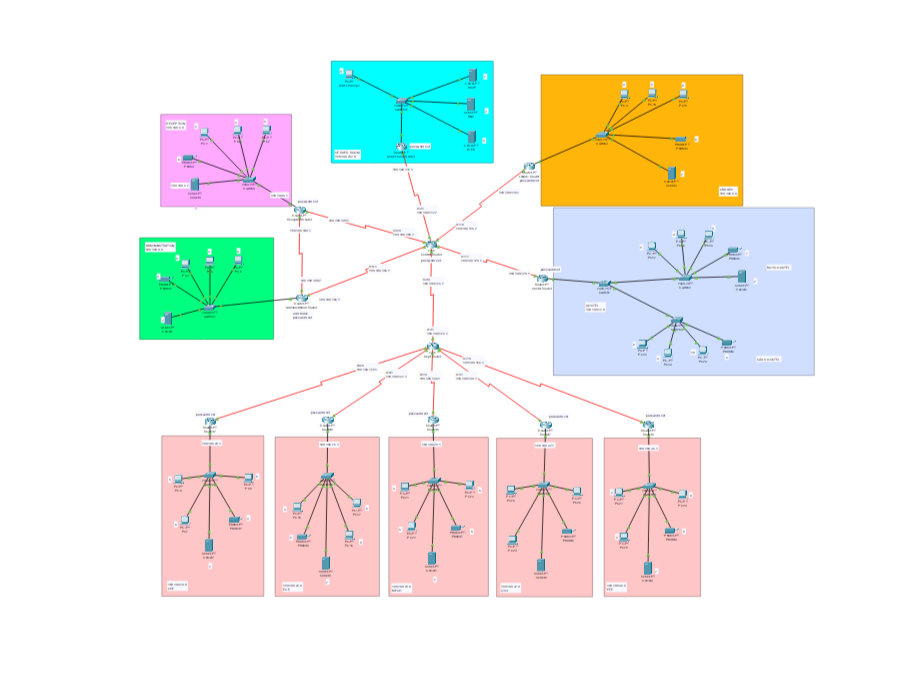

# College Network Design

The is a simulation of a college network done in cisco packet tracer


## Features

Used configurations, protocols, and others
- DHCP
- RIP
- DNS
- Web server(HTTP)
- Secure Routing

## Installation


```bash
  git clone https://github.com/punith-kumar-pr/college-network-design
```
- or download as a zip

Open the the file 'Mini Project.pkt' with 'Cisco Packet Tracer'

### Password for the routers in the network

- Central router
Username: admin
password: admin
enable mode: admin

- Adminstration router
```bash
Username: admin
password: admin
enable mode: admin
```

- Reception router
```bash
enable mode: reception
```

- Server router
```bash
enable mode: server
```

- Library router
```bash
enable mode: library
```

- Hostel router
```bash
enable mode: hostel
```

- Department's passwords
```bash
CSE  : cse
ECE  : ece
MECH : mech
CIVIL: civil
EEE  : eee
```
    
## Screenshots




## Appendix

For mono details refer the report in this repository

---

### Don't forget to give a star if you like it.


## Thank you
